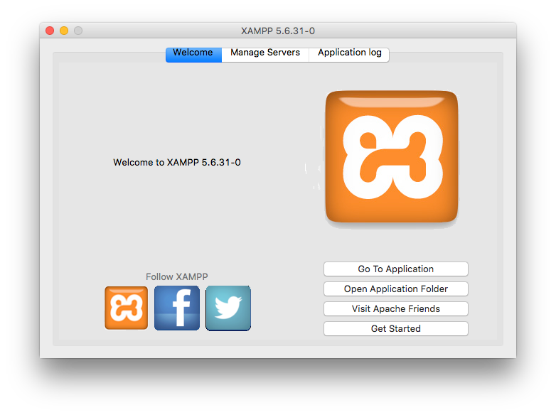
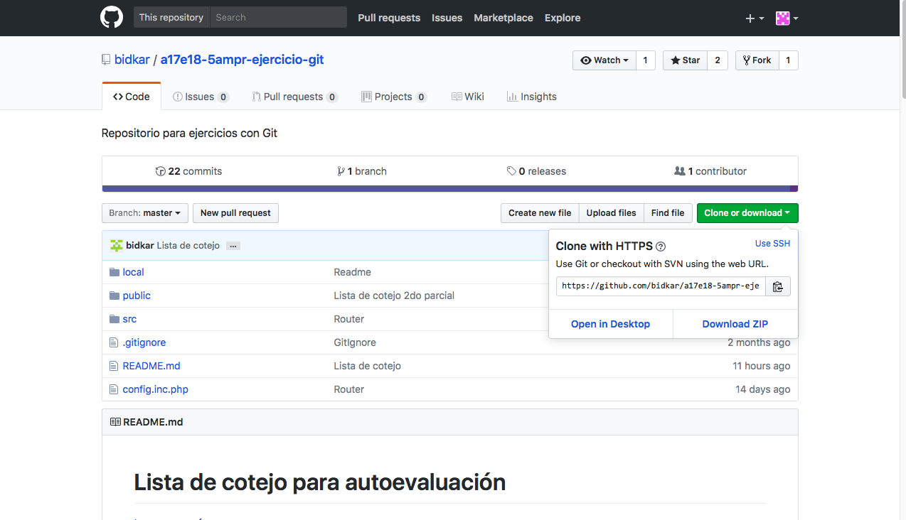

##Biblioteca CETis108
 ##Descripcion

 ##Requerimentos
 estos son los programas que necesitaremos para hacer uso de nuestro de el proyecto
 1. Xampp
 2. Visual Studio Code 
 3. Gitbash

 ##Instalacion de Requerimentos
 la instalacion de estos programas es muy facil basta con descargar los archivos de la pagina oficial e instalarlos.

##Instalacion del proyecto
vamos a bajar el repositorio desde github o git desktop
 
 
 ##Configuracion del proyecto
 podemos configurar nuestros archivos para cambiar el nombre en el navegador u otros cambios
 - DNS local (biblioteca.dev)
- Apache global (httpd.conf)
- Apache vhosts (httpd-vhosts.conf)

### Uso del proyecto
para usarlo solo corremos nuestro servidor y podemos entrar desde el navegador

Navegador (http://biblioteca.dev)

